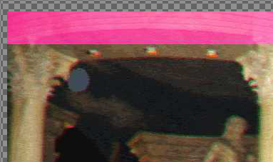
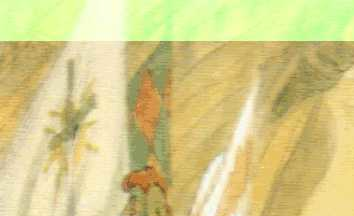
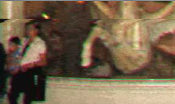
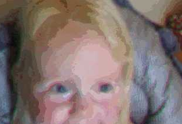
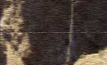
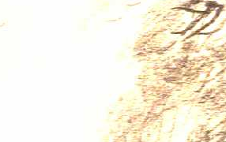
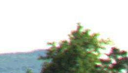
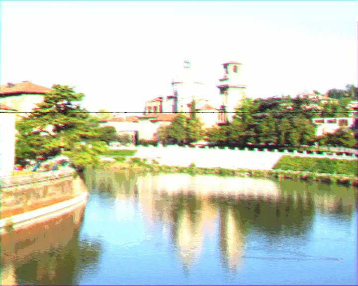

# Projet Data Science

> Projet d'option DataScience

## Le sujet

* Explication des processus métier de l'organisation du projet
	* Méthode CRISP
	* Comment noter les images ?
	* Quel environnement utiliser ?
		* En Dev
		* En Prod
* Pertiance de la solution
	* Pourquoi avoir utilisé ces algos ?
	* Pouquoi cette structure ?
	* Porquois ces traitements ?
* Explication des recherches
	* Recherches sur les filtres
	* Même les echecs
* Version video
	* Quels changements ?
	* Quels améliorations ?
	* Expliquer et discuter ?

### Méthodologie CRISP-DM

Nous avons utilisé durant ce projet la méthode CRISP-DM qui nous à permis d'analyser les données et de construie les données.
La méthodologie CRISP-DM donne les différentes étapes que l'on va suivre pour traitere les données reçues et concevoir un algorithme de machine learning.

1. **Business Understanding** : Dans cette première étape il est question de comprendre les besoins du client en discutant avec ce dernier. L'objectif est de connaitre le contexte dans lequel les données sont obtenues et dans lequel notre modèle sera utilisé.
2. **Data Unserstanding** : Il faut ensuite analyser les données pour en comprendre le format, la provenance, les éventuels biais qui pourrait apparaitre. C'est dans cette partie que l'on crée la carte d'identité du dataset et qu'on l'explore.
3. **Data Préparation** : L'objectif ici est de préparer les données pour qu'elles soient utilisées par l'algorithme de machine leanring. Cela inclue, la normalisation, l'élimination des doublons ou des null, etc.
4. **Modélisation** : Durant cette partie, on définis l'algorithme de machine leanring que nous allons utiliser ainsi que les différents seuperparamètres qui seront utilisés.
5. **Évaluation** : Enfin, on évalue les résultats de notre modèle pour en déduire la stratégie à adopter.

Ces différentes étapes représentent un cycle. Ce cycle est repris tant que les résultats du modèle ne sont pas satisfaisants. Des que l'on a un modèle satisfaisant, on peu le déployer pour l'utiliser en production.

### Livrables

* Un **Notebook** de rapport contenant :
	* Le prototype de la solution
	* Le workflow de modification des données
	* La démonstration de la pertinance des données
* Un **export serialisé du modèle** entrainé
* Un **pipeline complet** utilisable en l'état et utilisant le modèle exporté.

## Structure

Voici quelques explications sur la structure des dossiers de ce repository

* `dataset/` : Le dataset de test de notre système entier
* `dataset_clean_degraded/` : Le dataset de train et d'évaluation de notre modèle
	* `clean/` : Les images claires, objectif de notre système
	* `degraded/` : Les images dégradées à corriger
* `notebooks/` : Les notebooks Jupyter de recherche
* `labs/` : Un dossier de sandbox, tout les fichiers de ce dossier seront ignorés dans le repo
* `Sujet.docx` : Le sujet du projet
* `Sujet-Bonus.docx` : Les bonus du projet

### Scripts

* `jupyter.sh` : Démarre JupyterLab à la racine du repository (cela démarrera le virtualenv si besoin)
* `generate_empty_csv.py` : Genere un CSV vide avec uniquement les noms des fichiers dans la première colonne
* `./venv.sh` : Démarre un bash dans l'environnement virtuel python et installes les dépendances de `requirements.txt` (Python 3.7 requis)

### Fichiers externes

Certains fichiers sont nécéssaire au bon fonctionnement des scripts.
Ils peuvent être récuperés depuis Moodle.
Voici les fichiers requis et leur nom associé : 

* `dataset` : Un dossier comprenant les images dégradés uniquement [Télécharger sur Moodle](https://moodle-ingenieurs.cesi.fr/mod/resource/view.php?id=3234)
* `dataset_clean_degraded` : Un dossier comprenant les images propres (`clean`) et les images dégradés (`degraded`) associés [Télécharger sur Moodle](https://moodle-ingenieurs.cesi.fr/mod/resource/view.php?id=3237)
* `Sujet.docx` : Le sujet du projet en Docx [Télécharger sur Moodle](https://moodle-ingenieurs.cesi.fr/mod/resource/view.php?id=3233)
* `Sujet-Bonus.docx` : Le sujet bonus du projet [Télécharger sur Moodle](https://moodle-ingenieurs.cesi.fr/mod/resource/view.php?id=3238)

## Notes en vrac

* OpenCV pour traitement image
* [A Machine Learning Approach for Removal of JPEG Compression Artifacts: A Survey](https://www.researchgate.net/publication/298801742_A_Machine_Learning_Approach_for_Removal_of_JPEG_Compression_Artifacts_A_Survey)
* [Introduction to Restoring Video Quality: How to Improve Video with Filters](http://www.digitalfaq.com/guides/video/introduction-restore-video.htm)
* [Image comparison - fast algorithm](https://stackoverflow.com/questions/843972/image-comparison-fast-algorithm)

## Problèmes identifiés

* **Pinking** : Barre filtrante Magenta
* **Greening** : Barre filtrante Verte
* **Tearing** : Distortion, ligne déformante (I devient <)
* **Noise** : Bruis analogique
* **Black Line** : Ligne noir fine horizontal
* **White Line** : Ligne blanche fine horizontal
* **Over-exposure** : Surexposition en luminausité
* **Blur**: traits des objets moins distincts
* **Color shifting** : Aberration chromatiques Rouges et Vertes
* **JPEG Artefact** : Artefactes de compression JPEG
* **Posterisation** : Réduction du nombre valeurs des dégradés

|Pinking|Greening|Tearing|Noise|Black Line|Posterisation|
|-------|--------|-------|-----|----------|---|
|||||||
|**White Line**|**Over-exposure**|**Blur**|**Color Shifting**|**JPEG Artefact**|
||||||

### Labelisation des données

Nous avons pris quelques heures pour labéliser un subset des données de `dataset_clean_degraded` et en extraire les problèmes reconnus sur les images. Nous avons procédé comme suis : 

|Lignes|Personne|Labels éfféctués|
|------|--------|----------------|
|2 - 786|Nicolas|152|
|787 - 1573|Baptiste|100|
|1574 - 2360|Alexis|150|
|2361 - 3147|Clément|163|
|3148 - 3934|Etienne|100|
|3935 - 4721|Adrien K|50|
|4722 - 5501|Adrien T|200|
