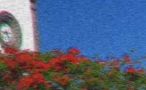
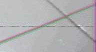
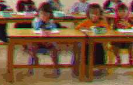

# Projet Data Science

> Projet d'option DataScience

## Structure

Voici quelques explications sur la structure des dossiers de ce repository

* `dataset/` : Le dataset de test de notre système entier
* `dataset_clean_degraded/` : Le dataset de train et d'évaluation de notre modèle
	* `clean/` : Les images claires, objectif de notre système
	* `degraded/` : Les images dégradées à corriger
* `notebooks/` : Les notebooks Jupyter de recherche
* `labs/` : Un dossier de sandbox, tout les fichiers de ce dossier seront ignorés dans le repo
* `Sujet.docx` : Le sujet du projet
* `Sujet-Bonus.docx` : Les bonus du projet

### Scripts

* `jupyter.sh` : Démarre JupyterLab à la racine du repository
* `generate_empty_csv.py` : Genere un CSV vide avec uniquement les noms des fichiers dans la première colonne

### Fichiers externes

Certains fichiers sont nécéssaire au bon fonctionnement des scripts.
Ils peuvent être récuperés depuis Moodle.
Voici les fichiers requis et leur nom associé : 

* `dataset` : Un dossier comprenant les images dégradés uniquement [Télécharger sur Moodle](https://moodle-ingenieurs.cesi.fr/mod/resource/view.php?id=3234)
* `dataset_clean_degraded` : Un dossier comprenant les images propres (`clean`) et les images dégradés (`degraded`) associés [Télécharger sur Moodle](https://moodle-ingenieurs.cesi.fr/mod/resource/view.php?id=3237)
* `Sujet.docx` : Le sujet du projet en Docx [Télécharger sur Moodle](https://moodle-ingenieurs.cesi.fr/mod/resource/view.php?id=3233)
* `Sujet-Bonus.docx` : Le sujet bonus du projet [Télécharger sur Moodle](https://moodle-ingenieurs.cesi.fr/mod/resource/view.php?id=3238)

## Notes en vrac

* OpenCV pour traitement image
* [A Machine Learning Approach for Removal of JPEG Compression Artifacts: A Survey](https://www.researchgate.net/publication/298801742_A_Machine_Learning_Approach_for_Removal_of_JPEG_Compression_Artifacts_A_Survey)
* [Introduction to Restoring Video Quality: How to Improve Video with Filters](http://www.digitalfaq.com/guides/video/introduction-restore-video.htm)

## Problèmes identifiés

* **Pinking** : Barre filtrante Magenta
* **Greening** : Barre filtrante Verte
* **Tearing** : Distortion, ligne déformante (I devient <)
* **Noise** : Bruis analogique
* **Black Line** : Ligne noir fine horizontal
* **White Line** : Ligne blanche fine horizontal
* **Over-exposure** : Surexposition en luminausité
* **Blur**: traits des objets moins distincts
* **Color shifting** : Aberration chromatiques Rouges et Vertes
* **JPEG Artefact** : Artefactes de compression JPEG

|Pinking|Greening|Tearing|Noise|Black Line|White Line|Over-exposure|Blur|Color Shifting|
|-------|--------|-------|-----|----------|----------|----------|----------|---|
||||||||||
